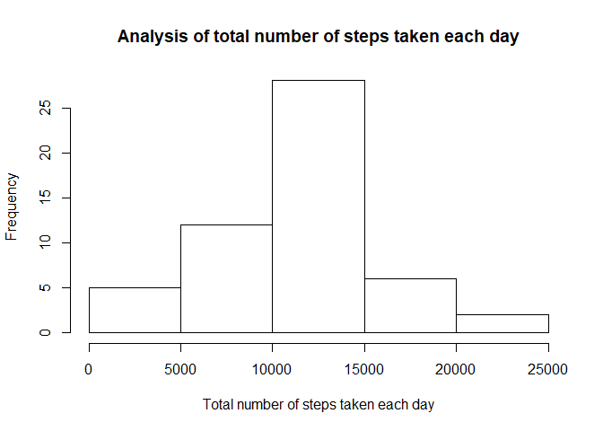
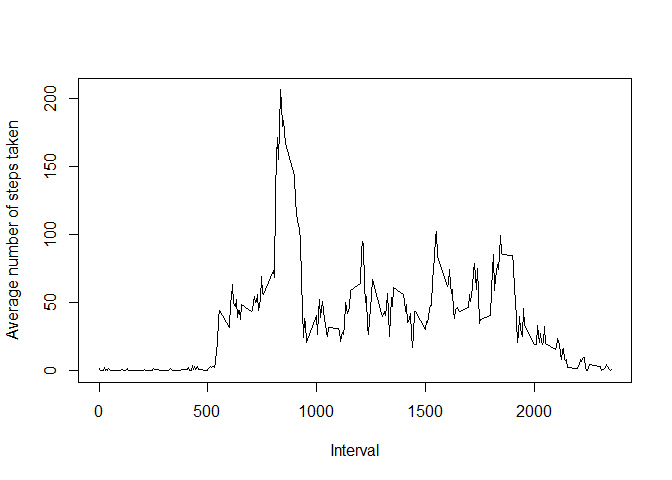
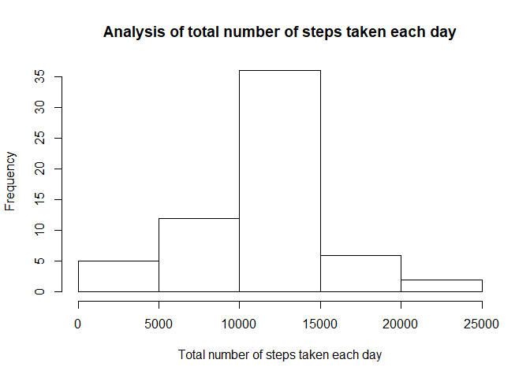
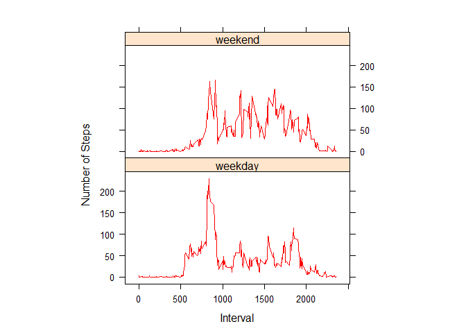

### Loading and preprocessing the data

In this step we are downloading the zip file if it does not already exist in the project folder.
The zip file is then extracted to the current folder and we get the activity.csv file.
This csv file is then read into data frame activity_data.
No further processing is required at this stage.


```r
library(dplyr)

#Set the working directory
setwd("D:\\DataScience\\CourseEra\\05.ReproducibleResearch\\Project0502\\RepData_PeerAssessment1")

# Download the zip file if it is not already present and extract to folder
url <- "https://d396qusza40orc.cloudfront.net/repdata%2Fdata%2Factivity.zip"
if(!file.exists("activity.zip")){
  download.file(url,"activity.zip", mode = "wb")
}
unzip("activity.zip", files = NULL, exdir=".")

# Read the data from training set
activity_data <- read.csv("activity.csv",header = TRUE, sep= ",")
```

***

### What is mean total number of steps taken per day?

**(a). Make a histogram of the total number of steps taken each day**

```r
activity_data_per_day <- activity_data %>% group_by(date) %>% summarise(total_steps = sum(steps)) 
hist(activity_data_per_day$total_steps, main="Analysis of total number of steps taken each day", xlab="Total number of steps taken each day", ylab="Frequency")
```

<!-- -->

**(b). Calculate and report the mean and median total number of steps taken per day**

```r
mean(activity_data_per_day$total_steps, na.rm = TRUE)
```

```
## [1] 10766
```

```r
median(activity_data_per_day$total_steps, na.rm = TRUE)
```

```
## [1] 10765
```
* The **mean** total number of steps taken per day is 10766 steps.
* The **median** total number of steps taken per day is 10765 steps.

***

### What is the average daily activity pattern?

**(a). Make a time series plot of the 5-minute interval (x-axis) and the average number of steps taken, averaged across all days (y-axis)**


```r
activity_data_per_interval <- activity_data %>% group_by(interval) %>% summarise(mean_steps = mean(as.numeric(steps), na.rm = TRUE))
plot(activity_data_per_interval$interval,activity_data_per_interval$mean_steps, type="l", ylab="Average number of steps taken", xlab="Interval")
```

<!-- -->

**(b). Which 5-minute interval, on average across all the days in the dataset, contains the maximum number of steps?**

```r
activity_data_per_interval[activity_data_per_interval$mean_steps==max(activity_data_per_interval$mean_steps), ]$interval
```

```
## [1] 835
```

* The **maximum number of steps** is observed in the interval: 835.

***

### Inputing missing values

**(a). Calculate and report the total number of missing values in the dataset**

```r
sum(is.na(activity_data$steps))
```

```
## [1] 2304
```
Total 2304 rows are missing values.

**(b). Devise a strategy for filling in all of the missing values in the dataset.**

The missing values are filled with the mean for that 5-minute interval. The data set created in previous step is used


```r
activity_data_without_na <- activity_data
activity_data_without_na$steps <- apply(activity_data_without_na, 1, 
                     function(row){
                       if(is.na(row["steps"])){
                         columnno <- as.numeric(row["interval"])
                         row["steps"] = activity_data_per_interval[activity_data_per_interval$interval == columnno,]$mean_steps 
                       }
                       row["steps"]
                      }
                     )
```

**(c). Make a histogram of the total number of steps taken each day and Calculate and report the mean and median total number of steps taken per day. **

```r
activity_data_without_na_per_day <- activity_data_without_na %>% group_by(date) %>% summarise(total_steps = sum(as.numeric(steps))) 
hist(activity_data_without_na_per_day$total_steps,main="Analysis of total number of steps taken each day", xlab="Total number of steps taken each day", ylab="Frequency")
```

<!-- -->

```r
mean(activity_data_without_na_per_day$total_steps)
```

```
## [1] 10766
```

```r
median(activity_data_without_na_per_day$total_steps)
```

```
## [1] 10766
```

* The **mean** total number of steps taken per day is 10766 steps.
* The **median** total number of steps taken per day is 10766 steps.

**(d). Do these values differ from the estimates from the first part of the assignment? What is the impact of imputing missing data on the estimates of the total daily number of steps?**

The **mean** value is the **same** as the value before imputing missing data because we put the mean value for that particular 5-min interval. The median value shows **a little** difference : but it depends on **where the missing values are**.

***

### Are there differences in activity patterns between weekdays and weekends?

**(a). Create a new factor variable in the dataset with two levels - "weekday" and "weekend" indicating whether a given date is a weekday or weekend day.**

```r
activity_data_without_na$day <- apply(activity_data_without_na, 1, 
                   function(row){ 
                     d<- weekdays(as.Date(row["date"]))
                     if(d %in% c("Saturday", "Sunday"))
                       "weekend"
                     else
                       "weekday"
                   }
                   )
activity_data_without_na$day=factor(activity_data_without_na$day)
```

**(b). Make a panel plot containing a time series plot of the 5-minute interval (x-axis) and the average number of steps taken, averaged across all weekday days or weekend days (y-axis).**


```r
activity_data_without_na_by_day <- activity_data_without_na %>% group_by(day, interval) %>% summarise(mean_steps = mean(as.numeric(steps), na.rm = TRUE))
library(lattice)
xyplot(mean_steps~interval|factor(day),data=activity_data_without_na_by_day,aspect=1/2,type="l", xlab="Interval", ylab="Number of Steps", col="red")
```

<!-- -->
